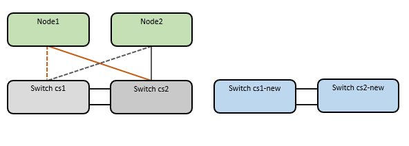

= Überprüfungsanforderungen
:allow-uri-read: 

== Überprüfungsanforderungen

Stellen Sie sicher, dass:

* Sie haben die Seriennummer des Switches überprüft, um sicherzustellen, dass der richtige Switch migriert wird.
* Einige der Ports der Nexus 9336C-FX2 Switches sind für den Betrieb mit 10GbE oder 40GbE konfiguriert.
* Die 10GbE- und 40GbE-Konnektivität von den Knoten zu den Nexus 9336C-FX2 Cluster-Switches wurde geplant, migriert und dokumentiert.
* Der Cluster ist voll funktionsfähig (es sollten keine Fehler in den Protokollen oder ähnliche Probleme auftreten).
* Die Erstkonfiguration der Cisco Nexus 9336C-FX2 Switches ist abgeschlossen, sodass:
+
** Auf den Switches vom Typ 9336C-FX2 läuft die neueste empfohlene Softwareversion.
** Bevor Sie die LIFs auf die neuen Switches migrieren, vergewissern Sie sich, dass die Referenzkonfigurationsdateien (RCFs) vollständig auf alle neuen Switches angewendet wurden.
** Prüfen Sie vor der Umleitung des Netzwerkverkehrs die laufenden und Startkonfigurationen beider Switches.
** Sämtliche Standortanpassungen, wie z. B. DNS, NTP, SMTP, SNMP und SSH, werden auf den neuen Switches konfiguriert.

* Sie haben Zugriff auf die Switch-Kompatibilitätstabelle auf dem https://mysupport.netapp.com/site/info/cisco-ethernet-switch["Cisco Ethernet-Switches"^] Seite für die unterstützten ONTAP, NX-OS- und RCF-Versionen.
* Sie haben die entsprechenden Software- und Upgrade-Anleitungen auf der Cisco -Website für die Upgrade- und Downgrade-Verfahren von Cisco Switches geprüft. https://www.cisco.com/c/en/us/support/switches/nexus-9000-series-switches/series.html["Cisco Nexus 9000 Series Switches Unterstützung"^] Seite.

NOTE: Wenn Sie die Portgeschwindigkeit der Cluster-Ports e0a und e1a auf AFF A800 oder AFF C800 Systemen ändern, kann es nach der Geschwindigkeitsumwandlung zu fehlerhaften Paketen kommen.  Sehen https://mysupport.netapp.com/site/bugs-online/product/ONTAP/BURT/1570339["Bug 1570339"^] und der Artikel in der Wissensdatenbank https://kb.netapp.com/onprem/ontap/hardware/CRC_errors_on_T6_ports_after_converting_from_40GbE_to_100GbE["CRC-Fehler an T6-Ports nach der Umstellung von 40GbE auf 100GbE"^] zur Orientierung.

== Migrieren Sie die Schalter

.Zu den Beispielen
Die Beispiele in diesem Verfahren verwenden zwei Knoten.  Diese Knoten nutzen zwei 10GbE-Cluster-Verbindungsports e0a und e0b.  Siehe die https://hwu.netapp.com/["Hardware Universe"^] um die korrekten Cluster-Ports auf Ihren Plattformen zu überprüfen.

NOTE: Die Befehlsausgaben können je nach ONTAP Version variieren.

Die Beispiele in diesem Verfahren verwenden die folgende Schalter- und Knotennomenklatur:

* Die Namen der beiden vorhandenen Cisco Switches lauten *cs1* und *cs2*.
* Die neuen Cluster-Switches Nexus 9336C-FX2 sind *cs1-new* und *cs2-new*.
* Die Knotennamen lauten *node1* und *node2*.
* Die Cluster-LIF-Namen lauten *node1_clus1* und *node1_clus2* für Knoten 1 sowie *node2_clus1* und *node2_clus2* für Knoten 2.
* Die Eingabeaufforderung *cluster1::*>* zeigt den Namen des Clusters an.

Beachten Sie bei diesem Vorgang das folgende Beispiel:

.Informationen zu diesem Vorgang
Das Verfahren erfordert die Verwendung sowohl von ONTAP -Befehlen als auch von https://www.cisco.com/c/en/us/support/switches/nexus-9000-series-switches/series.html["Switches der Nexus 9000-Serie"^] Befehle; es werden ONTAP -Befehle verwendet, sofern nicht anders angegeben.

Dieses Verfahren umfasst folgendes Szenario:

* Der Schalter cs2 wird zuerst durch den Schalter cs2-new ersetzt.
+
** Schalten Sie die Ports zu den Clusterknoten ab.  Um eine Instabilität des Clusters zu vermeiden, müssen alle Ports gleichzeitig abgeschaltet werden.
+
*** Alle Cluster-LIFs werden auf den neuen Switch cs2-new umgeschaltet.

** Die Verkabelung zwischen den Knoten und cs2 wird dann von cs2 getrennt und wieder mit cs2-new verbunden.

* Der Schalter cs1 wird durch den Schalter cs1-new ersetzt.
+
** Schalten Sie die Ports zu den Clusterknoten ab.  Um eine Instabilität des Clusters zu vermeiden, müssen alle Ports gleichzeitig abgeschaltet werden.
+
*** Alle Cluster-LIFs schalten auf den neuen Switch cs1-new um.

** Die Verkabelung zwischen den Knoten und cs1 wird dann von cs1 getrennt und wieder mit cs1-new verbunden.

NOTE: Während dieses Vorgangs ist kein betriebsbereiter Inter-Switch-Link (ISL) erforderlich. Dies ist beabsichtigt, da RCF-Versionsänderungen die ISL-Konnektivität vorübergehend beeinträchtigen können. Um einen unterbrechungsfreien Clusterbetrieb zu gewährleisten, wird während der Ausführung der Schritte auf dem Ziel-Switch ein Failover aller Cluster-LIFs auf den operativen Partner-Switch durchgeführt.

=== Schritt 1: Vorbereitung auf die Migration

. Wenn AutoSupport auf diesem Cluster aktiviert ist, unterdrücken Sie die automatische Fallerstellung durch Aufruf einer AutoSupport -Nachricht: `system node autosupport invoke -node * -type all -message MAINT=xh`
+
wobei _x_ die Dauer des Wartungsfensters in Stunden ist.

+

NOTE: Die AutoSupport Meldung benachrichtigt den technischen Support über diese Wartungsaufgabe, sodass die automatische Fallerstellung während des Wartungsfensters unterdrückt wird.

. Ändern Sie die Berechtigungsstufe auf „Erweitert“, indem Sie *y* eingeben, wenn Sie zur Fortsetzung aufgefordert werden:
+
`set -privilege advanced`

+
Die erweiterte Eingabeaufforderung (*>) wird angezeigt.

=== Schritt 2: Anschlüsse und Verkabelung konfigurieren

. Prüfen Sie an den neuen Switches, ob die ISL-Verbindung zwischen den Switches cs1-new und cs2-new hergestellt und funktionsfähig ist:
+
`show port-channel summary`

+
.Beispiel anzeigen
[%collapsible]
====
[listing, subs="+quotes"]
----
cs1-new# *show port-channel summary*
Flags:  D - Down        P - Up in port-channel (members)
        I - Individual  H - Hot-standby (LACP only)
        s - Suspended   r - Module-removed
        b - BFD Session Wait
        S - Switched    R - Routed
        U - Up (port-channel)
        p - Up in delay-lacp mode (member)
        M - Not in use. Min-links not met
--------------------------------------------------------------------------------
Group Port-       Type     Protocol  Member Ports
      Channel
--------------------------------------------------------------------------------
1     Po1(SU)     Eth      LACP      Eth1/35(P)   Eth1/36(P)

cs2-new# *show port-channel summary*
Flags:  D - Down        P - Up in port-channel (members)
        I - Individual  H - Hot-standby (LACP only)
        s - Suspended   r - Module-removed
        b - BFD Session Wait
        S - Switched    R - Routed
        U - Up (port-channel)
        p - Up in delay-lacp mode (member)
        M - Not in use. Min-links not met
--------------------------------------------------------------------------------
Group Port-       Type     Protocol  Member Ports
      Channel
--------------------------------------------------------------------------------
1     Po1(SU)     Eth      LACP      Eth1/35(P)   Eth1/36(P)
----
====
. Zeigen Sie die Cluster-Ports auf jedem Knoten an, die mit den vorhandenen Cluster-Switches verbunden sind:
+
`network device-discovery show`

+
.Beispiel anzeigen
[%collapsible]
====
[listing, subs="+quotes"]
----
cluster1::*> *network device-discovery show -protocol cdp*
Node/       Local  Discovered
Protocol    Port   Device (LLDP: ChassisID)  Interface         Platform
----------- ------ ------------------------- ----------------  ----------------
node1      /cdp
            e0a    cs1                       Ethernet1/1        N5K-C5596UP
            e0b    cs2                       Ethernet1/2        N5K-C5596UP
node2      /cdp
            e0a    cs1                       Ethernet1/1        N5K-C5596UP
            e0b    cs2                       Ethernet1/2        N5K-C5596UP
----
====
. Ermitteln Sie den administrativen oder operativen Status für jeden Cluster-Port.
+
.. Überprüfen Sie, ob alle Cluster-Ports aktiv und fehlerfrei sind:
+
`network port show -ipspace Cluster`

+
.Beispiel anzeigen
[%collapsible]
====
[listing, subs="+quotes"]
----
cluster1::*> *network port show -ipspace Cluster*

Node: node1
                                                                       Ignore
                                                  Speed(Mbps) Health   Health
Port      IPspace      Broadcast Domain Link MTU  Admin/Oper  Status   Status
--------- ------------ ---------------- ---- ---- ----------- -------- ------
e0a       Cluster      Cluster          up   9000  auto/10000 healthy  false
e0b       Cluster      Cluster          up   9000  auto/10000 healthy  false

Node: node2
                                                                       Ignore
                                                  Speed(Mbps) Health   Health
Port      IPspace      Broadcast Domain Link MTU  Admin/Oper  Status   Status
--------- ------------ ---------------- ---- ---- ----------- -------- ------
e0a       Cluster      Cluster          up   9000  auto/10000 healthy  false
e0b       Cluster      Cluster          up   9000  auto/10000 healthy  false
----
====
.. Überprüfen Sie, ob alle Cluster-Schnittstellen (LIFs) an ihren jeweiligen Heimatports angeschlossen sind:
+
`network interface show -vserver Cluster`

+
.Beispiel anzeigen
[%collapsible]
====
[listing, subs="+quotes"]
----
cluster1::*> *network interface show -vserver Cluster*

            Logical      Status     Network            Current     Current Is
Vserver     Interface    Admin/Oper Address/Mask       Node        Port    Home
----------- -----------  ---------- ------------------ ----------- ------- ----
Cluster
            node1_clus1  up/up      169.254.209.69/16  node1       e0a     true
            node1_clus2  up/up      169.254.49.125/16  node1       e0b     true
            node2_clus1  up/up      169.254.47.194/16  node2       e0a     true
            node2_clus2  up/up      169.254.19.183/16  node2       e0b     true
----
====
.. Überprüfen Sie, ob der Cluster Informationen für beide Cluster-Switches anzeigt:
+
`system cluster-switch show -is-monitoring-enabled-operational true`

+
.Beispiel anzeigen
[%collapsible]
====
[listing, subs="+quotes"]
----
cluster1::*> *system cluster-switch show -is-monitoring-enabled-operational true*
Switch                      Type               Address          Model
--------------------------- ------------------ ---------------- ---------------
cs1                         cluster-network    10.233.205.92    N5K-C5596UP
      Serial Number: FOXXXXXXXGS
       Is Monitored: true
             Reason: None
   Software Version: Cisco Nexus Operating System (NX-OS) Software, Version
                     9.3(4)
     Version Source: CDP

cs2                         cluster-network     10.233.205.93   N5K-C5596UP
      Serial Number: FOXXXXXXXGD
       Is Monitored: true
             Reason: None
   Software Version: Cisco Nexus Operating System (NX-OS) Software, Version
                     9.3(4)
     Version Source: CDP
----
====

. [[step_4]]Automatische Rücksetzung der Cluster-LIFs deaktivieren.
+
Durch Deaktivierung der automatischen Rückstellung für diesen Vorgang werden die Cluster-LIFs nicht automatisch zu ihrem Heimatport zurückbewegt.  Sie bleiben im derzeitigen Hafen, solange dieser in Betrieb ist.

+
`network interface modify -vserver Cluster -lif * -auto-revert false`

+

NOTE: Durch Deaktivieren der automatischen Rücksetzung wird sichergestellt, dass ONTAP nur dann auf die Cluster-LIFs zurückgreift, wenn die Switch-Ports später heruntergefahren werden.

. Schalten Sie auf dem Cluster-Switch cs2 die Ports ab, die mit den Cluster-Ports *aller* Knoten verbunden sind, um ein Failover der Cluster-LIFs zu erzwingen:
+
[listing, subs="+quotes"]
----
cs2# *configure*
cs2(config)# *interface eth1/1-1/2*
cs2(config-if-range)# *shutdown*
cs2(config-if-range)# *exit*
cs2(config)# *exit*
cs2#
----
. Überprüfen Sie, ob die Cluster-LIFs auf die Ports des Cluster-Switches cs1 umgeschaltet haben. Dies kann einige Sekunden dauern.
+
`network interface show -vserver Cluster`

+
.Beispiel anzeigen
[%collapsible]
====
[listing, subs="+quotes"]
----
cluster1::*> *network interface show -vserver Cluster*
            Logical       Status     Network            Current    Current Is
Vserver     Interface     Admin/Oper Address/Mask       Node       Port    Home
----------- ------------- ---------- ------------------ ---------- ------- ----
Cluster
            node1_clus1   up/up      169.254.3.4/16     node1      e0a     true
            node1_clus2   up/up      169.254.3.5/16     node1      e0a     false
            node2_clus1   up/up      169.254.3.8/16     node2      e0a     true
            node2_clus2   up/up      169.254.3.9/16     node2      e0a     false
----
====
. Überprüfen Sie, ob der Cluster fehlerfrei funktioniert:
+
`cluster show`

+
.Beispiel anzeigen
[%collapsible]
====
[listing, subs="+quotes"]
----
cluster1::*> cluster show
Node       Health  Eligibility   Epsilon
---------- ------- ------------- -------
node1      true    true          false
node2      true    true          false
----
====
. Wenn die Cluster-LIFs auf Switch cs1 umgeschaltet haben und der Cluster fehlerfrei ist, fahren Sie mit folgendem fort:<<step_10,Schritt. 10>> Die  Falls einige Cluster-LIFs nicht fehlerfrei sind oder der Cluster insgesamt fehlerhaft ist, können Sie die Konnektivität zum Switch cs2 wie folgt wiederherstellen:
+
.. Aktivieren Sie die Ports, die mit den Cluster-Ports *aller* Knoten verbunden sind:
+
[listing, subs="+quotes"]
----
cs2# *configure*
cs2(config)# *interface eth1/1-1/2*
cs2(config-if-range)# *no shutdown*
cs2(config-if-range)# *exit*
cs2(config)# *exit*
cs2#
----
.. Überprüfen Sie, ob die Cluster-LIFs auf die Ports des Cluster-Switches cs1 umgeschaltet haben. Dies kann einige Sekunden dauern.
+
`network interface show -vserver Cluster`

+
.Beispiel anzeigen
[%collapsible]
====
[listing, subs="+quotes"]
----
cluster1::*> *network interface show -vserver Cluster*
            Logical       Status     Network            Current    Current Is
Vserver     Interface     Admin/Oper Address/Mask       Node       Port    Home
----------- ------------- ---------- ------------------ ---------- ------- ----
Cluster
            node1_clus1   up/up      169.254.3.4/16     node1      e0a     true
            node1_clus2   up/up      169.254.3.5/16     node1      e0a     false
            node2_clus1   up/up      169.254.3.8/16     node2      e0a     true
            node2_clus2   up/up      169.254.3.9/16     node2      e0a     false
----
====
.. Überprüfen Sie, ob der Cluster fehlerfrei funktioniert:
+
`cluster show`

+
.Beispiel anzeigen
[%collapsible]
====
[listing, subs="+quotes"]
----
cluster1::*> cluster show
Node       Health  Eligibility   Epsilon
---------- ------- ------------- -------
node1      true    true          false
node2      true    true          false
----
====

. Sobald Sie LIF und die Clusterintegrität wiederhergestellt haben, starten Sie den Prozess neu.<<step_4,Schritt. 4>> Die
. [[step_10]]Verlegen Sie alle Cluster-Knotenverbindungskabel vom alten cs2-Switch zum neuen cs2-new-Switch.
+
*Die Verbindungskabel der Clusterknoten wurden an den Switch cs2-new angeschlossen.*

+
image::../media/new_switch_cs1.png[Die Verbindungskabel der Clusterknoten wurden an den Switch cs2-new angeschlossen.]

. Bestätigen Sie den Zustand der nach cs2-new verschobenen Netzwerkverbindungen:
+
`network port show -ipspace Cluster`

+
.Beispiel anzeigen
[%collapsible]
====
[listing, subs="+quotes"]
----
cluster1::*> *network port show -ipspace Cluster*

Node: node1
                                                                       Ignore
                                                  Speed(Mbps) Health   Health
Port      IPspace      Broadcast Domain Link MTU  Admin/Oper  Status   Status
--------- ------------ ---------------- ---- ---- ----------- -------- ------
e0a       Cluster      Cluster          up   9000  auto/10000 healthy  false
e0b       Cluster      Cluster          up   9000  auto/10000 healthy  false

Node: node2
                                                                       Ignore
                                                  Speed(Mbps) Health   Health
Port      IPspace      Broadcast Domain Link MTU  Admin/Oper  Status   Status
--------- ------------ ---------------- ---- ---- ----------- -------- ------
e0a       Cluster      Cluster          up   9000  auto/10000 healthy  false
e0b       Cluster      Cluster          up   9000  auto/10000 healthy  false
----
====
+
Alle verschobenen Cluster-Ports sollten nun aktiv sein.

. Überprüfen Sie die Nachbarinformationen an den Cluster-Ports:
+
`network device-discovery show -protocol cdp`

+
.Beispiel anzeigen
[%collapsible]
====
[listing, subs="+quotes"]
----
cluster1::*> *network device-discovery show -protocol cdp*

Node/       Local  Discovered
Protocol    Port   Device (LLDP: ChassisID)  Interface      Platform
----------- ------ ------------------------- -------------  --------------
node1      /cdp
            e0a    cs1                       Ethernet1/1    N5K-C5596UP
            e0b    cs2-new                   Ethernet1/1/1  N9K-C9336C-FX2

node2      /cdp
            e0a    cs1                       Ethernet1/2    N5K-C5596UP
            e0b    cs2-new                   Ethernet1/1/2  N9K-C9336C-FX2
----
====
+
Überprüfen Sie, ob die verschobenen Cluster-Ports den Switch cs2-new als Nachbarn erkennen.

. Prüfen Sie die Switch-Port-Verbindungen aus der Perspektive des Switches cs2-new:
+
[listing, subs="+quotes"]
----
cs2-new# *show interface brief*
cs2-new# *show cdp neighbors*
----
. Um ein Failover der Cluster-LIFs durchzuführen, müssen auf dem Cluster-Switch cs1 die mit den Cluster-Ports *aller* Knoten verbundenen Ports abgeschaltet werden.
+
[listing, subs="+quotes"]
----
cs1# *configure*
cs1(config)# *interface eth1/1-1/2*
cs1(config-if-range)# *shutdown*
cs1(config-if-range)# *exit*
cs1(config)# *exit*
cs1#
----
+
Alle Cluster-LIFs schalten auf den Switch cs2-new um.

. Überprüfen Sie, ob die Cluster-LIFs auf die Ports des Switches cs2-new umgeschaltet haben.  Dies kann einige Sekunden dauern:
+
`network interface show -vserver Cluster`

+
.Beispiel anzeigen
[%collapsible]
====
[listing, subs="+quotes"]
----
cluster1::*> *network interface show -vserver Cluster*
            Logical      Status     Network            Current     Current Is
Vserver     Interfac     Admin/Oper Address/Mask       Node        Port    Home
----------- ------------ ---------- ------------------ ----------- ------- ----
Cluster
            node1_clus1  up/up      169.254.3.4/16     node1       e0b     false
            node1_clus2  up/up      169.254.3.5/16     node1       e0b     true
            node2_clus1  up/up      169.254.3.8/16     node2       e0b     false
            node2_clus2  up/up      169.254.3.9/16     node2       e0b     true
----
====
. Überprüfen Sie, ob der Cluster fehlerfrei funktioniert:
+
`cluster show`

+
.Beispiel anzeigen
[%collapsible]
====
[listing, subs="+quotes"]
----
cluster1::*> *cluster show*
Node       Health  Eligibility   Epsilon
---------- ------- ------------- -------
node1      true    true          false
node2      true    true          false
----
====
. Verlegen Sie die Cluster-Knoten-Verbindungskabel von cs1 zum neuen Switch cs1-new.
+
*Die Verbindungskabel der Clusterknoten wurden an den Switch cs1-new angeschlossen.*

+
image::../media/new_switch_cs2.png[Die Verbindungskabel der Clusterknoten wurden an den Switch cs1-new verlegt.]

. Prüfen Sie den Zustand der Netzwerkverbindungen, die nach cs1-new verschoben wurden:
+
`network port show -ipspace Cluster`

+
.Beispiel anzeigen
[%collapsible]
====
[listing, subs="+quotes"]
----
cluster1::*> *network port show -ipspace Cluster*

Node: node1
                                                                       Ignore
                                                  Speed(Mbps) Health   Health
Port      IPspace      Broadcast Domain Link MTU  Admin/Oper  Status   Status
--------- ------------ ---------------- ---- ---- ----------- -------- ------
e0a       Cluster      Cluster          up   9000  auto/10000 healthy  false
e0b       Cluster      Cluster          up   9000  auto/10000 healthy  false

Node: node2
                                                                       Ignore
                                                  Speed(Mbps) Health   Health
Port      IPspace      Broadcast Domain Link MTU  Admin/Oper  Status   Status
--------- ------------ ---------------- ---- ---- ----------- -------- ------
e0a       Cluster      Cluster          up   9000  auto/10000 healthy  false
e0b       Cluster      Cluster          up   9000  auto/10000 healthy  false
----
====
+
Alle verschobenen Cluster-Ports sollten nun aktiv sein.

. Überprüfen Sie die Nachbarinformationen an den Cluster-Ports:
+
`network device-discovery show`

+
.Beispiel anzeigen
[%collapsible]
====
[listing, subs="+quotes"]
----
cluster1::*> *network device-discovery show -protocol cdp*
Node/       Local  Discovered
Protocol    Port   Device (LLDP: ChassisID)  Interface       Platform
----------- ------ ------------------------- --------------  --------------
node1      /cdp
            e0a    cs1-new                   Ethernet1/1/1   N9K-C9336C-FX2
            e0b    cs2-new                   Ethernet1/1/2   N9K-C9336C-FX2

node2      /cdp
            e0a    cs1-new                   Ethernet1/1/1   N9K-C9336C-FX2
            e0b    cs2-new                   Ethernet1/1/2   N9K-C9336C-FX2
----
====
+
Überprüfen Sie, ob die verschobenen Cluster-Ports den Switch cs1-new als Nachbarn erkennen.

. Prüfen Sie die Switch-Port-Verbindungen aus der Perspektive des Switches cs1-new:
+
[listing, subs="+quotes"]
----
cs1-new# *show interface brief*
cs1-new# *show cdp neighbors*
----
. Überprüfen Sie, ob die ISL-Verbindung zwischen cs1-new und cs2-new noch funktioniert:
+
`show port-channel summary`

+
.Beispiel anzeigen
[%collapsible]
====
[listing, subs="+quotes"]
----
cs1-new# *show port-channel summary*
Flags:  D - Down        P - Up in port-channel (members)
        I - Individual  H - Hot-standby (LACP only)
        s - Suspended   r - Module-removed
        b - BFD Session Wait
        S - Switched    R - Routed
        U - Up (port-channel)
        p - Up in delay-lacp mode (member)
        M - Not in use. Min-links not met
--------------------------------------------------------------------------------
Group Port-       Type     Protocol  Member Ports
      Channel
--------------------------------------------------------------------------------
1     Po1(SU)     Eth      LACP      Eth1/35(P)   Eth1/36(P)

cs2-new# *show port-channel summary*
Flags:  D - Down        P - Up in port-channel (members)
        I - Individual  H - Hot-standby (LACP only)
        s - Suspended   r - Module-removed
        b - BFD Session Wait
        S - Switched    R - Routed
        U - Up (port-channel)
        p - Up in delay-lacp mode (member)
        M - Not in use. Min-links not met
--------------------------------------------------------------------------------
Group Port-       Type     Protocol  Member Ports
      Channel
--------------------------------------------------------------------------------
1     Po1(SU)     Eth      LACP      Eth1/35(P)   Eth1/36(P)
----
====

=== Schritt 3: Konfiguration überprüfen

. Automatische Wiederherstellung der Cluster-LIFs aktivieren.
+
`network interface modify -vserver Cluster -lif * -auto-revert true`

. Auf Switch cs2 müssen alle Cluster-Ports heruntergefahren und neu gestartet werden, um eine automatische Rücksetzung aller Cluster-LIFs auszulösen, die sich nicht an ihren Home-Ports befinden.
+
[listing, subs="+quotes"]
----
cs2> *enable*
cs2# *configure*
cs2(config)# *interface eth1/1-1/2*
cs2(config-if-range)# *shutdown*

(Wait for 5-10 seconds before re-enabling the ports)

cs2(config-if-range)# *no shutdown*

(After executing the no shutdown command, the nodes detect the change and begin to auto-revert the cluster LIFs to their home ports)

cs2(config-if-range)# *exit*
cs2(config)# *exit*
cs2#
----
. Überprüfen Sie, ob die Cluster-LIFs wieder auf ihre ursprünglichen Ports zurückgesetzt wurden (dies kann eine Minute dauern):
+
`network interface show -vserver Cluster`

+
Falls eine der Cluster-LIFs nicht auf ihren Heimatport zurückgesetzt wurde, setzen Sie sie manuell zurück. Sie müssen eine Verbindung zur jeweiligen Node-Management-LIF- oder SP/ BMC -Systemkonsole des lokalen Knotens herstellen, dem die LIF gehört:

+
`network interface revert -vserver Cluster -lif *`

. Überprüfen Sie, ob der Cluster fehlerfrei funktioniert:
+
`cluster show`

. Überprüfen Sie die Konnektivität der Remote-Cluster-Schnittstellen:

[role="tabbed-block"]
====
.ONTAP 9.9.1 und höher
--
Sie können die `network interface check cluster-connectivity` Befehl zum Starten einer Zugriffsprüfung für die Clusterkonnektivität und anschließenden Anzeigen der Details:

`network interface check cluster-connectivity start`Und `network interface check cluster-connectivity show`

[listing, subs="+quotes"]
----
cluster1::*> *network interface check cluster-connectivity start*
----

NOTE: Warten Sie einige Sekunden, bevor Sie den Befehl ausführen. `show` Befehl zum Anzeigen der Details.

[listing, subs="+quotes"]
----
cluster1::*> *network interface check cluster-connectivity show*
                                  Source          Destination       Packet
Node   Date                       LIF             LIF               Loss
------ -------------------------- --------------- ----------------- -----------
node1
       3/5/2022 19:21:18 -06:00   node1_clus2      node2_clus1      none
       3/5/2022 19:21:20 -06:00   node1_clus2      node2_clus2      none

node2
       3/5/2022 19:21:18 -06:00   node2_clus2      node1_clus1      none
       3/5/2022 19:21:20 -06:00   node2_clus2      node1_clus2      none
----
--
.Alle ONTAP Versionen
--
Für alle ONTAP Versionen können Sie auch die `cluster ping-cluster -node <name>` Befehl zum Überprüfen der Verbindung:

`cluster ping-cluster -node <name>`

[listing, subs="+quotes"]
----
cluster1::*> *cluster ping-cluster -node node2*
Host is node2
Getting addresses from network interface table...
Cluster node1_clus1 169.254.209.69 node1     e0a
Cluster node1_clus2 169.254.49.125 node1     e0b
Cluster node2_clus1 169.254.47.194 node2     e0a
Cluster node2_clus2 169.254.19.183 node2     e0b
Local = 169.254.47.194 169.254.19.183
Remote = 169.254.209.69 169.254.49.125
Cluster Vserver Id = 4294967293
Ping status:

Basic connectivity succeeds on 4 path(s)
Basic connectivity fails on 0 path(s)
................
Detected 9000 byte MTU on 4 path(s):
    Local 169.254.19.183 to Remote 169.254.209.69
    Local 169.254.19.183 to Remote 169.254.49.125
    Local 169.254.47.194 to Remote 169.254.209.69
    Local 169.254.47.194 to Remote 169.254.49.125
Larger than PMTU communication succeeds on 4 path(s)
RPC status:
2 paths up, 0 paths down (tcp check)
2 paths up, 0 paths down (udp check)
----
--
====
. [[step6]]Wenn Sie die automatische Fallerstellung unterdrückt haben, aktivieren Sie sie wieder, indem Sie eine AutoSupport Nachricht aufrufen: `system node autosupport invoke -node * -type all -message MAINT=END`

.Wie geht es weiter?
Nach der Migration der Switches können Sielink:../switch-cshm/config-overview.html["Konfigurieren der Switch-Integritätsüberwachung"] Die
