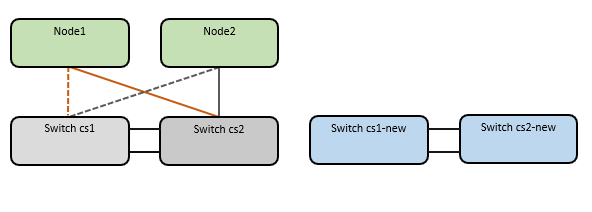

= Migrieren Sie von einem älteren Cisco Switch zu einem Cisco Nexus 9336C-FX2 Cluster Switch
:allow-uri-read: 
:icons: font
:imagesdir: ../media/

[role="lead"]
Sie können ältere Cisco Cluster Switches für ein ONTAP Cluster zu Cisco Nexus 9336C-FX2 Storage-Netzwerk-Switches migrieren. Hierbei handelt es sich um ein unterbrechungsfreies Verfahren.

== Prüfen Sie die Anforderungen

Stellen Sie sicher, dass:

* Einige der Ports auf Nexus 9336C-FX2-Switches sind für 10-GbE- oder 40-GbE-Betrieb konfiguriert.
* Die 10GbE- und 40-GbE-Konnektivität von den Nodes zu Nexus 9336C-FX2 Cluster-Switches wurde geplant, migriert und dokumentiert.
* Das Cluster funktioniert voll (es sollten keine Fehler in den Protokollen oder ähnlichen Problemen geben).
* Die anfängliche Anpassung der Cisco Nexus 9336C-FX2 Switches lautet folgendermaßen:
+
** 9336C-FX2-Switches führen die neueste empfohlene Version der Software aus.
** Auf die Switches wurden Referenzkonfigurationsdateien (RCFs) angewendet.
** Anpassung von Websites, z. B. DNS, NTP, SMTP, SNMP, Und SSH werden auf den neuen Switches konfiguriert.

* Sie haben Zugriff auf die Switch-Kompatibilitätstabelle auf der https://mysupport.netapp.com/site/info/cisco-ethernet-switch["Cisco Ethernet-Switches"^] Seite für die unterstützten ONTAP-, NX-OS- und RCF-Versionen.
* Sie haben die entsprechenden Software- und Upgrade-Leitfäden auf der Cisco Website für die Upgrade- und Downgrade-Verfahren von Cisco Switches unter geprüft https://www.cisco.com/c/en/us/support/switches/nexus-9000-series-switches/series.html["Switches Der Cisco Nexus 9000-Serie Unterstützen"^] Seite.

NOTE: Wenn Sie die Portgeschwindigkeit der e0a- und e1a-Cluster-Ports auf AFF A800- oder AFF C800-Systemen ändern, können Sie beobachten, wie fehlerhafte Pakete nach der Geschwindigkeitskonvertierung empfangen werden. Siehe  https://mysupport.netapp.com/site/bugs-online/product/ONTAP/BURT/1570339["Bug 1570339"^] Und den Knowledge Base Artikel https://kb.netapp.com/onprem/ontap/hardware/CRC_errors_on_T6_ports_after_converting_from_40GbE_to_100GbE["CRC-Fehler auf T6-Ports nach der Konvertierung von 40GbE zu 100GbE"^] Für eine Anleitung.

== Migrieren Sie die Switches

.Zu den Beispielen
Die Beispiele in diesem Verfahren verwenden zwei Knoten. Diese Nodes verwenden zwei 10-GbE-Cluster Interconnect-Ports e0a und e0b. Siehe https://hwu.netapp.com/["Hardware Universe"^] Um sicherzustellen, dass die korrekten Cluster-Ports auf Ihren Plattformen vorhanden sind.

NOTE: Die Ausgaben für die Befehle können je nach verschiedenen Versionen von ONTAP variieren.

Die Beispiele in diesem Verfahren verwenden die folgende Nomenklatur für Switches und Knoten:

* Die Namen der beiden vorhandenen Cisco Switches sind *cs1* und *cs2*
* Die neuen Nexus 9336C-FX2 Cluster Switches sind *cs1-neu* und *cs2-neu*.
* Die Knotennamen sind *node1* und *node2*.
* Die Cluster-LIF-Namen sind *node1_clus1* und *node1_clus2* für Knoten 1, und *node2_clus1* und *node2_clus2* für Knoten 2.
* Die Eingabeaufforderung *cluster1::*>* gibt den Namen des Clusters an.

Beachten Sie während dieses Verfahrens das folgende Beispiel:

.Über diese Aufgabe
Das Verfahren erfordert die Verwendung von ONTAP-Befehlen und https://www.cisco.com/c/en/us/support/switches/nexus-9000-series-switches/series.html["Switches Der Nexus 9000 Serie"^] Befehle; ONTAP-Befehle werden verwendet, sofern nicht anders angegeben.

Dieses Verfahren umfasst das folgende Szenario:

* Schalter cs2 wird zuerst durch Schalter cs2-New ersetzt.
+
** Fahren Sie die Ports zu den Cluster-Nodes herunter. Alle Ports müssen gleichzeitig heruntergefahren werden, um eine Instabilität von Clustern zu vermeiden.
** Die Verkabelung zwischen den Knoten und cs2 wird dann von cs2 getrennt und wieder mit cs2-New verbunden.

* Switch cs1 wird durch Switch cs1-New ersetzt.
+
** Fahren Sie die Ports zu den Cluster-Nodes herunter. Alle Ports müssen gleichzeitig heruntergefahren werden, um eine Instabilität von Clustern zu vermeiden.
** Die Verkabelung zwischen den Knoten und cs1 wird dann von cs1 getrennt und wieder mit cs1-New verbunden.

NOTE: Bei diesem Verfahren ist keine betriebsbereite ISL (Inter Switch Link) erforderlich. Dies ist von Grund auf so, dass Änderungen der RCF-Version die ISL-Konnektivität vorübergehend beeinträchtigen können. Um einen unterbrechungsfreien Clusterbetrieb zu gewährleisten, werden mit dem folgenden Verfahren alle Cluster-LIFs auf den betriebsbereiten Partner-Switch migriert, während die Schritte auf dem Ziel-Switch ausgeführt werden.

=== Schritt: Bereiten Sie sich auf die Migration vor

. Wenn AutoSupport in diesem Cluster aktiviert ist, unterdrücken Sie die automatische Erstellung eines Falls durch Aufrufen einer AutoSupport Meldung: `system node autosupport invoke -node * -type all -message MAINT=xh`
+
Wobei _x_ die Dauer des Wartungsfensters in Stunden ist.

+

NOTE: Die AutoSupport Meldung wird vom technischen Support dieser Wartungsaufgabe benachrichtigt, damit die automatische Case-Erstellung während des Wartungsfensters unterdrückt wird.

. Ändern Sie die Berechtigungsebene in Erweitert, und geben Sie *y* ein, wenn Sie dazu aufgefordert werden, fortzufahren:
+
`set -privilege advanced`

+
Die erweiterte Eingabeaufforderung (*>) wird angezeigt.

=== Schritt: Ports und Verkabelung konfigurieren

. Vergewissern Sie sich bei den neuen Switches, dass die ISL zwischen den Switches cs1-New und cs2-New verkabelt und ordnungsgemäß funktioniert:
+
`show port-channel summary`

+
.Beispiel anzeigen
[%collapsible]
====
[listing, subs="+quotes"]
----
cs1-new# *show port-channel summary*
Flags:  D - Down        P - Up in port-channel (members)
        I - Individual  H - Hot-standby (LACP only)
        s - Suspended   r - Module-removed
        b - BFD Session Wait
        S - Switched    R - Routed
        U - Up (port-channel)
        p - Up in delay-lacp mode (member)
        M - Not in use. Min-links not met
--------------------------------------------------------------------------------
Group Port-       Type     Protocol  Member Ports
      Channel
--------------------------------------------------------------------------------
1     Po1(SU)     Eth      LACP      Eth1/35(P)   Eth1/36(P)

cs2-new# *show port-channel summary*
Flags:  D - Down        P - Up in port-channel (members)
        I - Individual  H - Hot-standby (LACP only)
        s - Suspended   r - Module-removed
        b - BFD Session Wait
        S - Switched    R - Routed
        U - Up (port-channel)
        p - Up in delay-lacp mode (member)
        M - Not in use. Min-links not met
--------------------------------------------------------------------------------
Group Port-       Type     Protocol  Member Ports
      Channel
--------------------------------------------------------------------------------
1     Po1(SU)     Eth      LACP      Eth1/35(P)   Eth1/36(P)
----
====
. Anzeigen der Cluster-Ports an jedem Node, der mit den vorhandenen Cluster-Switches verbunden ist:
+
`network device-discovery show`

+
.Beispiel anzeigen
[%collapsible]
====
[listing, subs="+quotes"]
----
cluster1::*> *network device-discovery show -protocol cdp*
Node/       Local  Discovered
Protocol    Port   Device (LLDP: ChassisID)  Interface         Platform
----------- ------ ------------------------- ----------------  ----------------
node1      /cdp
            e0a    cs1                       Ethernet1/1        N5K-C5596UP
            e0b    cs2                       Ethernet1/2        N5K-C5596UP
node2      /cdp
            e0a    cs1                       Ethernet1/1        N5K-C5596UP
            e0b    cs2                       Ethernet1/2        N5K-C5596UP
----
====
. Legen Sie den Administrations- oder Betriebsstatus für jeden Cluster-Port fest.
+
.. Vergewissern Sie sich, dass alle Cluster-Ports einen ordnungsgemäßen Status aufweisen:
+
`network port show -ipspace Cluster`

+
.Beispiel anzeigen
[%collapsible]
====
[listing, subs="+quotes"]
----
cluster1::*> *network port show -ipspace Cluster*

Node: node1
                                                                       Ignore
                                                  Speed(Mbps) Health   Health
Port      IPspace      Broadcast Domain Link MTU  Admin/Oper  Status   Status
--------- ------------ ---------------- ---- ---- ----------- -------- ------
e0a       Cluster      Cluster          up   9000  auto/10000 healthy  false
e0b       Cluster      Cluster          up   9000  auto/10000 healthy  false

Node: node2
                                                                       Ignore
                                                  Speed(Mbps) Health   Health
Port      IPspace      Broadcast Domain Link MTU  Admin/Oper  Status   Status
--------- ------------ ---------------- ---- ---- ----------- -------- ------
e0a       Cluster      Cluster          up   9000  auto/10000 healthy  false
e0b       Cluster      Cluster          up   9000  auto/10000 healthy  false
----
====
.. Vergewissern Sie sich, dass sich alle Cluster-Schnittstellen (LIFs) auf ihren Home-Ports befinden:
+
`network interface show -vserver Cluster`

+
.Beispiel anzeigen
[%collapsible]
====
[listing, subs="+quotes"]
----
cluster1::*> *network interface show -vserver Cluster*

            Logical      Status     Network            Current     Current Is
Vserver     Interface    Admin/Oper Address/Mask       Node        Port    Home
----------- -----------  ---------- ------------------ ----------- ------- ----
Cluster
            node1_clus1  up/up      169.254.209.69/16  node1       e0a     true
            node1_clus2  up/up      169.254.49.125/16  node1       e0b     true
            node2_clus1  up/up      169.254.47.194/16  node2       e0a     true
            node2_clus2  up/up      169.254.19.183/16  node2       e0b     true
----
====
.. Vergewissern Sie sich, dass auf dem Cluster Informationen für beide Cluster-Switches angezeigt werden:
+
`system cluster-switch show -is-monitoring-enabled-operational true`

+
.Beispiel anzeigen
[%collapsible]
====
[listing, subs="+quotes"]
----
cluster1::*> *system cluster-switch show -is-monitoring-enabled-operational true*
Switch                      Type               Address          Model
--------------------------- ------------------ ---------------- ---------------
cs1                         cluster-network    10.233.205.92    N5K-C5596UP
      Serial Number: FOXXXXXXXGS
       Is Monitored: true
             Reason: None
   Software Version: Cisco Nexus Operating System (NX-OS) Software, Version
                     9.3(4)
     Version Source: CDP

cs2                         cluster-network     10.233.205.93   N5K-C5596UP
      Serial Number: FOXXXXXXXGD
       Is Monitored: true
             Reason: None
   Software Version: Cisco Nexus Operating System (NX-OS) Software, Version
                     9.3(4)
     Version Source: CDP
----
====

. Deaktivieren Sie die automatische Zurücksetzen auf den Cluster-LIFs.
+
`network interface modify -vserver Cluster -lif * -auto-revert false`

. Fahren Sie bei Cluster-Switch cs2 die Ports herunter, die mit den Cluster-Ports der Nodes verbunden sind, um ein Failover der Cluster-LIFs zu ermöglichen:
+
[listing, subs="+quotes"]
----
cs2(config)# *interface eth1/1-1/2*
cs2(config-if-range)# *shutdown*
----
. Vergewissern Sie sich, dass für die Cluster-LIFs ein Failover zu den auf Cluster-Switch cs1 gehosteten Ports durchgeführt wurde. Dies kann einige Sekunden dauern.
+
`network interface show -vserver Cluster`

+
.Beispiel anzeigen
[%collapsible]
====
[listing, subs="+quotes"]
----
cluster1::*> *network interface show -vserver Cluster*
            Logical       Status     Network            Current    Current Is
Vserver     Interface     Admin/Oper Address/Mask       Node       Port    Home
----------- ------------- ---------- ------------------ ---------- ------- ----
Cluster
            node1_clus1   up/up      169.254.3.4/16     node1      e0a     true
            node1_clus2   up/up      169.254.3.5/16     node1      e0a     false
            node2_clus1   up/up      169.254.3.8/16     node2      e0a     true
            node2_clus2   up/up      169.254.3.9/16     node2      e0a     false
----
====
. Vergewissern Sie sich, dass das Cluster sich in einem ordnungsgemäßen Zustand befindet:
+
`cluster show`

+
.Beispiel anzeigen
[%collapsible]
====
[listing, subs="+quotes"]
----
cluster1::*> cluster show
Node       Health  Eligibility   Epsilon
---------- ------- ------------- -------
node1      true    true          false
node2      true    true          false
----
====
. Verschieben Sie alle Clusterknoten-Verbindungskabel vom alten cs2-Switch auf den neuen cs2-New-Switch.
+
*Clusterknoten-Verbindungskabel wurden auf den cs2-New Switch* verlegt

+
image::../media/new_switch_cs1.png[Verbindungskabel für Clusterknoten wurden auf den cs2-New-Switch verlegt]

. Überprüfen Sie den Zustand der zu cs2-New übergewechselt Netzwerkverbindungen:
+
`network port show -ipspace Cluster`

+
.Beispiel anzeigen
[%collapsible]
====
[listing, subs="+quotes"]
----
cluster1::*> *network port show -ipspace Cluster*

Node: node1
                                                                       Ignore
                                                  Speed(Mbps) Health   Health
Port      IPspace      Broadcast Domain Link MTU  Admin/Oper  Status   Status
--------- ------------ ---------------- ---- ---- ----------- -------- ------
e0a       Cluster      Cluster          up   9000  auto/10000 healthy  false
e0b       Cluster      Cluster          up   9000  auto/10000 healthy  false

Node: node2
                                                                       Ignore
                                                  Speed(Mbps) Health   Health
Port      IPspace      Broadcast Domain Link MTU  Admin/Oper  Status   Status
--------- ------------ ---------------- ---- ---- ----------- -------- ------
e0a       Cluster      Cluster          up   9000  auto/10000 healthy  false
e0b       Cluster      Cluster          up   9000  auto/10000 healthy  false
----
====
+
Alle verschiebten Cluster-Ports sollten nach oben erfolgen.

. Überprüfen Sie die „Neighbor“-Informationen auf den Cluster-Ports:
+
`network device-discovery show -protocol cdp`

+
.Beispiel anzeigen
[%collapsible]
====
[listing, subs="+quotes"]
----
cluster1::*> *network device-discovery show -protocol cdp*

Node/       Local  Discovered
Protocol    Port   Device (LLDP: ChassisID)  Interface      Platform
----------- ------ ------------------------- -------------  --------------
node1      /cdp
            e0a    cs1                       Ethernet1/1    N5K-C5596UP
            e0b    cs2-new                   Ethernet1/1/1  N9K-C9336C-FX2

node2      /cdp
            e0a    cs1                       Ethernet1/2    N5K-C5596UP
            e0b    cs2-new                   Ethernet1/1/2  N9K-C9336C-FX2
----
====
+
Vergewissern Sie sich, dass der cs2-neue Switch von den verschobenen Cluster-Ports als „Nachbarn“ angezeigt wird.

. Bestätigen Sie die Switch-Port-Verbindungen aus der Perspektive von Switch cs2-New:
+
[listing, subs="+quotes"]
----
cs2-new# *show interface brief*
cs2-new# *show cdp neighbors*
----
. Fahren Sie bei Cluster-Switch cs1 die Ports herunter, die mit den Cluster-Ports der Nodes verbunden sind, um ein Failover der Cluster-LIFs durchzuführen. Im folgenden Beispiel wird die Ausgabe des Schnittstellenbeispiels aus Schritt 7 verwendet.
+
[listing, subs="+quotes"]
----
cs1(config)# *interface eth1/1-1/2*
cs1(config-if-range)# *shutdown*
----
+
Alle Cluster-LIFs bewegen sich zum cs2-neuen Switch.

. Überprüfen Sie, ob für die Cluster-LIFs ein Failover zu den auf Switch cs2-New gehosteten Ports durchgeführt wurde. Dies kann einige Sekunden dauern:
+
`network interface show -vserver Cluster`

+
.Beispiel anzeigen
[%collapsible]
====
[listing, subs="+quotes"]
----
cluster1::*> *network interface show -vserver Cluster*
            Logical      Status     Network            Current     Current Is
Vserver     Interfac     Admin/Oper Address/Mask       Node        Port    Home
----------- ------------ ---------- ------------------ ----------- ------- ----
Cluster
            node1_clus1  up/up      169.254.3.4/16     node1       e0b     false
            node1_clus2  up/up      169.254.3.5/16     node1       e0b     true
            node2_clus1  up/up      169.254.3.8/16     node2       e0b     false
            node2_clus2  up/up      169.254.3.9/16     node2       e0b     true
----
====
. Vergewissern Sie sich, dass das Cluster sich in einem ordnungsgemäßen Zustand befindet:
+
`cluster show`

+
.Beispiel anzeigen
[%collapsible]
====
[listing, subs="+quotes"]
----
cluster1::*> *cluster show*
Node       Health  Eligibility   Epsilon
---------- ------- ------------- -------
node1      true    true          false
node2      true    true          false
----
====
. Verschieben Sie die Verbindungskabel des Clusterknoten von cs1 zum neuen cs1-New-Switch.
+
*Clusterknoten-Verbindungskabel wurden auf den cs1-New Switch* verlegt

+
image::../media/new_switch_cs2.png[Verbindungskabel für Clusterknoten wurden auf den cs1-New-Switch verlegt]

. Überprüfen Sie den Zustand der zu cs1-New übergewechselt Netzwerkverbindungen:
+
`network port show -ipspace Cluster`

+
.Beispiel anzeigen
[%collapsible]
====
[listing, subs="+quotes"]
----
cluster1::*> *network port show -ipspace Cluster*

Node: node1
                                                                       Ignore
                                                  Speed(Mbps) Health   Health
Port      IPspace      Broadcast Domain Link MTU  Admin/Oper  Status   Status
--------- ------------ ---------------- ---- ---- ----------- -------- ------
e0a       Cluster      Cluster          up   9000  auto/10000 healthy  false
e0b       Cluster      Cluster          up   9000  auto/10000 healthy  false

Node: node2
                                                                       Ignore
                                                  Speed(Mbps) Health   Health
Port      IPspace      Broadcast Domain Link MTU  Admin/Oper  Status   Status
--------- ------------ ---------------- ---- ---- ----------- -------- ------
e0a       Cluster      Cluster          up   9000  auto/10000 healthy  false
e0b       Cluster      Cluster          up   9000  auto/10000 healthy  false
----
====
+
Alle verschiebten Cluster-Ports sollten nach oben erfolgen.

. Überprüfen Sie die „Neighbor“-Informationen auf den Cluster-Ports:
+
`network device-discovery show`

+
.Beispiel anzeigen
[%collapsible]
====
[listing, subs="+quotes"]
----
cluster1::*> *network device-discovery show -protocol cdp*
Node/       Local  Discovered
Protocol    Port   Device (LLDP: ChassisID)  Interface       Platform
----------- ------ ------------------------- --------------  --------------
node1      /cdp
            e0a    cs1-new                   Ethernet1/1/1   N9K-C9336C-FX2
            e0b    cs2-new                   Ethernet1/1/2   N9K-C9336C-FX2

node2      /cdp
            e0a    cs1-new                   Ethernet1/1/1   N9K-C9336C-FX2
            e0b    cs2-new                   Ethernet1/1/2   N9K-C9336C-FX2
----
====
+
Vergewissern Sie sich, dass die verschiebten Cluster-Ports den cs1-neuen Switch als Nachbarn sehen.

. Bestätigen Sie die Switch-Port-Verbindungen aus der Perspektive von Switch cs1-New:
+
[listing, subs="+quotes"]
----
cs1-new# *show interface brief*
cs1-new# *show cdp neighbors*
----
. Vergewissern Sie sich, dass die ISL zwischen cs1-New und cs2-New weiterhin betriebsbereit ist:
+
`show port-channel summary`

+
.Beispiel anzeigen
[%collapsible]
====
[listing, subs="+quotes"]
----
cs1-new# *show port-channel summary*
Flags:  D - Down        P - Up in port-channel (members)
        I - Individual  H - Hot-standby (LACP only)
        s - Suspended   r - Module-removed
        b - BFD Session Wait
        S - Switched    R - Routed
        U - Up (port-channel)
        p - Up in delay-lacp mode (member)
        M - Not in use. Min-links not met
--------------------------------------------------------------------------------
Group Port-       Type     Protocol  Member Ports
      Channel
--------------------------------------------------------------------------------
1     Po1(SU)     Eth      LACP      Eth1/35(P)   Eth1/36(P)

cs2-new# *show port-channel summary*
Flags:  D - Down        P - Up in port-channel (members)
        I - Individual  H - Hot-standby (LACP only)
        s - Suspended   r - Module-removed
        b - BFD Session Wait
        S - Switched    R - Routed
        U - Up (port-channel)
        p - Up in delay-lacp mode (member)
        M - Not in use. Min-links not met
--------------------------------------------------------------------------------
Group Port-       Type     Protocol  Member Ports
      Channel
--------------------------------------------------------------------------------
1     Po1(SU)     Eth      LACP      Eth1/35(P)   Eth1/36(P)
----
====

=== Schritt 3: Überprüfen Sie die Konfiguration

. Aktivieren Sie die Funktion zum automatischen Zurücksetzen auf den Cluster-LIFs.
+
`network interface modify -vserver Cluster -lif * -auto-revert true`

. Überprüfen Sie, ob die Cluster-LIFs auf ihre Home-Ports zurückgesetzt wurden (dies kann eine Minute dauern):
+
`network interface show -vserver Cluster`

+
Wenn die Cluster-LIFs nicht auf ihren Home-Port zurückgesetzt wurden, setzen Sie sie manuell zurück:

+
`network interface revert -vserver Cluster -lif *`

. Vergewissern Sie sich, dass das Cluster sich in einem ordnungsgemäßen Zustand befindet:
+
`cluster show`

. Überprüfen Sie die Konnektivität der Remote-Cluster-Schnittstellen:

[role="tabbed-block"]
====
.ONTAP 9.9.1 und höher
--
Sie können das verwenden `network interface check cluster-connectivity` Befehl, um eine Zugriffsprüfung für die Cluster-Konnektivität zu starten und dann Details anzuzeigen:

`network interface check cluster-connectivity start` Und `network interface check cluster-connectivity show`

[listing, subs="+quotes"]
----
cluster1::*> *network interface check cluster-connectivity start*
----
*HINWEIS:* Warten Sie einige Sekunden, bevor Sie den Befehl show ausführen, um die Details anzuzeigen.

[listing, subs="+quotes"]
----
cluster1::*> *network interface check cluster-connectivity show*
                                  Source          Destination       Packet
Node   Date                       LIF             LIF               Loss
------ -------------------------- --------------- ----------------- -----------
node1
       3/5/2022 19:21:18 -06:00   node1_clus2      node2_clus1      none
       3/5/2022 19:21:20 -06:00   node1_clus2      node2_clus2      none

node2
       3/5/2022 19:21:18 -06:00   node2_clus2      node1_clus1      none
       3/5/2022 19:21:20 -06:00   node2_clus2      node1_clus2      none
----
--
.Alle ONTAP Versionen
--
Sie können für alle ONTAP Versionen auch den verwenden `cluster ping-cluster -node <name>` Befehl zum Überprüfen der Konnektivität:

`cluster ping-cluster -node <name>`

[listing, subs="+quotes"]
----
cluster1::*> *cluster ping-cluster -node node2*
Host is node2
Getting addresses from network interface table...
Cluster node1_clus1 169.254.209.69 node1     e0a
Cluster node1_clus2 169.254.49.125 node1     e0b
Cluster node2_clus1 169.254.47.194 node2     e0a
Cluster node2_clus2 169.254.19.183 node2     e0b
Local = 169.254.47.194 169.254.19.183
Remote = 169.254.209.69 169.254.49.125
Cluster Vserver Id = 4294967293
Ping status:
....
Basic connectivity succeeds on 4 path(s)
Basic connectivity fails on 0 path(s)
................
Detected 9000 byte MTU on 4 path(s):
    Local 169.254.19.183 to Remote 169.254.209.69
    Local 169.254.19.183 to Remote 169.254.49.125
    Local 169.254.47.194 to Remote 169.254.209.69
    Local 169.254.47.194 to Remote 169.254.49.125
Larger than PMTU communication succeeds on 4 path(s)
RPC status:
2 paths up, 0 paths down (tcp check)
2 paths up, 0 paths down (udp check)
----
--
====
. [[step5]]Aktivieren Sie die Protokollaufnahmefunktion für die Statusüberwachung des Ethernet-Switches, um Switch-bezogene Protokolldateien zu erfassen.

[role="tabbed-block"]
====
.ONTAP 9.8 und höher
--
Aktivieren Sie die Protokollerfassungsfunktion für die Ethernet Switch-Systemzustandsüberwachung, um Switch-bezogene Protokolldateien zu erfassen. Verwenden Sie dazu die folgenden beiden Befehle: `system switch ethernet log setup-password` Und `system switch ethernet log enable-collection`

*HINWEIS:* Sie benötigen das Passwort für den *admin*-Benutzer auf den Switches.

Geben Sie Ein: `system switch ethernet log setup-password`

[listing, subs="+quotes"]
----
cluster1::*> *system switch ethernet log setup-password*
Enter the switch name: <return>
The switch name entered is not recognized.
Choose from the following list:
cs1-new
cs2-new

cluster1::*> *system switch ethernet log setup-password*

Enter the switch name: *cs1-new*
RSA key fingerprint is e5:8b:c6:dc:e2:18:18:09:36:63:d9:63:dd:03:d9:cc
Do you want to continue? {y|n}::[n] *y*

Enter the password: <password of switch's admin user>
Enter the password again: <password of switch's admin user>

cluster1::*> *system switch ethernet log setup-password*

Enter the switch name: *cs2-new*
RSA key fingerprint is 57:49:86:a1:b9:80:6a:61:9a:86:8e:3c:e3:b7:1f:b1
Do you want to continue? {y|n}:: [n] *y*

Enter the password: <password of switch's admin user>
Enter the password again: <password of switch's admin user>
----
Gefolgt von: `system switch ethernet log enable-collection`

[listing, subs="+quotes"]
----
cluster1::*> *system  switch ethernet log enable-collection*

Do you want to enable cluster log collection for all nodes in the cluster?
{y|n}: [n] *y*

Enabling cluster switch log collection.

cluster1::*>
----
*HINWEIS:* Wenn einer dieser Befehle einen Fehler zurückgibt, wenden Sie sich an den NetApp Support.

--
.ONTAP veröffentlicht 9.5P16, 9.6P12 und 9.7P10 sowie neuere Patch-Releases
--
Aktivieren Sie die Protokollerfassungsfunktion für die Ethernet Switch-Systemzustandsüberwachung mithilfe der Befehle, um Switch-bezogene Protokolldateien zu erfassen: `system cluster-switch log setup-password` Und `system cluster-switch log enable-collection`

*HINWEIS:* Sie benötigen das Passwort für den *admin*-Benutzer auf den Switches.

Geben Sie Ein: `system cluster-switch log setup-password`

[listing, subs="+quotes"]
----
cluster1::*> *system cluster-switch log setup-password*
Enter the switch name: <return>
The switch name entered is not recognized.
Choose from the following list:
cs1-new
cs2-new

cluster1::*> *system cluster-switch log setup-password*

Enter the switch name: *cs1-new*
RSA key fingerprint is e5:8b:c6:dc:e2:18:18:09:36:63:d9:63:dd:03:d9:cc
Do you want to continue? {y|n}::[n] *y*

Enter the password: <password of switch's admin user>
Enter the password again: <password of switch's admin user>

cluster1::*> *system cluster-switch log setup-password*

Enter the switch name: *cs2-new*
RSA key fingerprint is 57:49:86:a1:b9:80:6a:61:9a:86:8e:3c:e3:b7:1f:b1
Do you want to continue? {y|n}:: [n] *y*

Enter the password: <password of switch's admin user>
Enter the password again: <password of switch's admin user>
----
Gefolgt von: `system cluster-switch log enable-collection`

[listing, subs="+quotes"]
----
cluster1::*> *system cluster-switch log enable-collection*

Do you want to enable cluster log collection for all nodes in the cluster?
{y|n}: [n] *y*

Enabling cluster switch log collection.

cluster1::*>
----
*HINWEIS:* Wenn einer dieser Befehle einen Fehler zurückgibt, wenden Sie sich an den NetApp Support.

--
====
. [[step6]]Wenn Sie die automatische Fallerstellung unterdrückt haben, aktivieren Sie sie erneut, indem Sie eine AutoSupport-Meldung aufrufen: `system node autosupport invoke -node * -type all -message MAINT=END`

