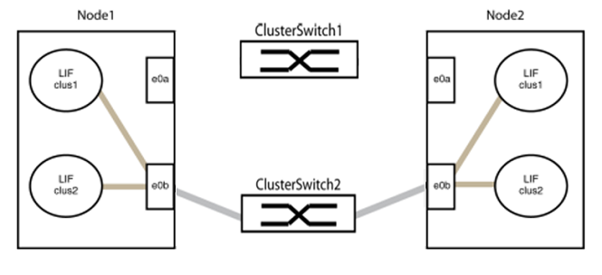
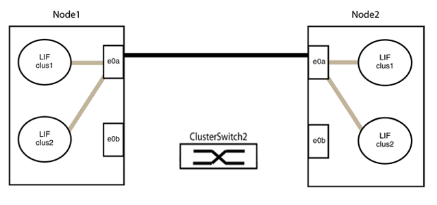

= Ersetzen Sie NVIDIA SN2100-Cluster-Switches durch Switch-lose Verbindungen
:allow-uri-read: 
:icons: font
:imagesdir: ../media/

[role="lead"]
Sie können von einem Cluster mit einem Switch-Cluster-Netzwerk zu einem migrieren, mit dem zwei Nodes direkt für ONTAP 9.3 und höher verbunden sind.

== Prüfen Sie die Anforderungen

.Richtlinien
Lesen Sie sich die folgenden Richtlinien durch:

* Die Migration auf eine Cluster-Konfiguration mit zwei Nodes ohne Switches ist ein unterbrechungsfreier Betrieb. Die meisten Systeme verfügen auf jedem Node über zwei dedizierte Cluster Interconnect Ports, jedoch können Sie dieses Verfahren auch für Systeme mit einer größeren Anzahl an dedizierten Cluster Interconnect Ports auf jedem Node verwenden, z. B. vier, sechs oder acht.
* Sie können die Cluster Interconnect-Funktion ohne Switches nicht mit mehr als zwei Nodes verwenden.
* Wenn Sie bereits über ein zwei-Node-Cluster mit Cluster Interconnect Switches verfügen und ONTAP 9.3 oder höher ausgeführt wird, können Sie die Switches durch direkte Back-to-Back-Verbindungen zwischen den Nodes ersetzen.

.Was Sie benötigen
* Ein gesundes Cluster, das aus zwei durch Cluster-Switches verbundenen Nodes besteht. Auf den Nodes muss dieselbe ONTAP Version ausgeführt werden.
* Jeder Node mit der erforderlichen Anzahl an dedizierten Cluster-Ports, die redundante Cluster Interconnect-Verbindungen bereitstellen, um die Systemkonfiguration zu unterstützen. Beispielsweise gibt es zwei redundante Ports für ein System mit zwei dedizierten Cluster Interconnect Ports auf jedem Node.

== Migrieren Sie die Switches

.Über diese Aufgabe
Durch das folgende Verfahren werden die Cluster-Switches in einem 2-Node-Cluster entfernt und jede Verbindung zum Switch durch eine direkte Verbindung zum Partner-Node ersetzt.

image::../media/tnsc_clusterswitches_and_direct_connections.PNG[Cluster-Switches wurden durch direkte Verbindungen ersetzt]

.Zu den Beispielen
Die Beispiele in dem folgenden Verfahren zeigen Nodes, die „e0a“ und „e0b“ als Cluster-Ports verwenden. Ihre Nodes verwenden möglicherweise unterschiedliche Cluster-Ports, je nach System.

=== Schritt: Bereiten Sie sich auf die Migration vor

. Ändern Sie die Berechtigungsebene in erweitert, indem Sie eingeben `y` Wenn Sie dazu aufgefordert werden, fortzufahren:
+
`set -privilege advanced`

+
Die erweiterte Eingabeaufforderung `*>` Angezeigt.

. ONTAP 9.3 und höher unterstützt die automatische Erkennung von Clustern ohne Switches, die standardmäßig aktiviert sind.
+
Sie können überprüfen, ob die Erkennung von Clustern ohne Switch durch Ausführen des Befehls „Advanced Privilege“ aktiviert ist:

+
`network options detect-switchless-cluster show`

+
.Beispiel anzeigen
[%collapsible]
====
Die folgende Beispielausgabe zeigt, ob die Option aktiviert ist.

[listing]
----
cluster::*> network options detect-switchless-cluster show
   (network options detect-switchless-cluster show)
Enable Switchless Cluster Detection: true
----
====
+
Wenn „Switch less Cluster Detection aktivieren“ lautet `false`, Wen Sie sich an den NetApp Support.

. Wenn AutoSupport in diesem Cluster aktiviert ist, unterdrücken Sie die automatische Erstellung eines Falls durch Aufrufen einer AutoSupport Meldung:
+
`system node autosupport invoke -node * -type all -message MAINT=<number_of_hours>h`

+
Wo `h` Dies ist die Dauer des Wartungsfensters von Stunden. Die Meldung wird vom technischen Support dieser Wartungsaufgabe benachrichtigt, damit die automatische Case-Erstellung während des Wartungsfensters unterdrückt werden kann.

+
Im folgenden Beispiel unterdrückt der Befehl die automatische Case-Erstellung für zwei Stunden:

+
.Beispiel anzeigen
[%collapsible]
====
[listing]
----
cluster::*> system node autosupport invoke -node * -type all -message MAINT=2h
----
====

=== Schritt: Ports und Verkabelung konfigurieren

. Ordnen Sie die Cluster-Ports an jedem Switch in Gruppen, so dass die Cluster-Ports in grop1 zu Cluster-Switch 1 wechseln und die Cluster-Ports in grop2 zu Cluster-Switch 2 wechseln. Diese Gruppen sind später im Verfahren erforderlich.
. Ermitteln der Cluster-Ports und Überprüfen von Verbindungsstatus und Systemzustand:
+
`network port show -ipspace Cluster`

+
Im folgenden Beispiel für Knoten mit Cluster-Ports „e0a“ und „e0b“ wird eine Gruppe als „node1:e0a“ und „node2:e0a“ und die andere Gruppe als „node1:e0b“ und „node2:e0b“ identifiziert. Ihre Nodes verwenden möglicherweise unterschiedliche Cluster-Ports, da diese je nach System variieren.

+
image::../media/tnsc_clusterswitch_connections.PNG[Cluster-Switch-Verbindungen zwischen node1 und node2]

+
Überprüfen Sie, ob die Ports einen Wert von haben `up` Für die Spalte „Link“ und einen Wert von `healthy` Für die Spalte „Integritätsstatus“.

+
.Beispiel anzeigen
[%collapsible]
====
[listing]
----
cluster::> network port show -ipspace Cluster
Node: node1
                                                                 Ignore
                                             Speed(Mbps) Health  Health
Port  IPspace   Broadcast Domain Link  MTU   Admin/Oper	 Status  Status
----- --------- ---------------- ----- ----- ----------- ------- -------
e0a   Cluster   Cluster          up    9000  auto/10000  healthy false
e0b   Cluster   Cluster          up    9000  auto/10000  healthy false

Node: node2
                                                                 Ignore
                                             Speed(Mbps) Health  Health
Port  IPspace   Broadcast Domain Link  MTU   Admin/Oper	 Status  Status
----- --------- ---------------- ----- ----- ----------- ------- -------
e0a   Cluster   Cluster          up    9000  auto/10000  healthy false
e0b   Cluster   Cluster          up    9000  auto/10000  healthy false
4 entries were displayed.
----
====
. Vergewissern Sie sich, dass alle Cluster-LIFs auf ihren Home-Ports sind.
+
Vergewissern Sie sich, dass die Spalte „ist-Home“ angezeigt wird `true` Für jedes der Cluster-LIFs:

+
`network interface show -vserver Cluster -fields is-home`

+
.Beispiel anzeigen
[%collapsible]
====
[listing]
----
cluster::*> net int show -vserver Cluster -fields is-home
(network interface show)
vserver  lif          is-home
-------- ------------ --------
Cluster  node1_clus1  true
Cluster  node1_clus2  true
Cluster  node2_clus1  true
Cluster  node2_clus2  true
4 entries were displayed.
----
====
+
Wenn Cluster-LIFs sich nicht auf ihren Home-Ports befinden, setzen Sie die LIFs auf ihre Home-Ports zurück:

+
`network interface revert -vserver Cluster -lif *`

. Deaktivieren Sie die automatische Zurücksetzung für die Cluster-LIFs:
+
`network interface modify -vserver Cluster -lif * -auto-revert false`

. Vergewissern Sie sich, dass alle im vorherigen Schritt aufgeführten Ports mit einem Netzwerk-Switch verbunden sind:
+
`network device-discovery show -port _cluster_port_`

+
Die Spalte „ermittelte Geräte“ sollte der Name des Cluster-Switch sein, mit dem der Port verbunden ist.

+
.Beispiel anzeigen
[%collapsible]
====
Das folgende Beispiel zeigt, dass Cluster-Ports „e0a“ und „e0b“ korrekt mit Cluster-Switches „cs1“ und „cs2“ verbunden sind.

[listing]
----
cluster::> network device-discovery show -port e0a|e0b
  (network device-discovery show)
Node/     Local  Discovered
Protocol  Port   Device (LLDP: ChassisID)  Interface  Platform
--------- ------ ------------------------- ---------- ----------
node1/cdp
          e0a    cs1                       0/11       BES-53248
          e0b    cs2                       0/12       BES-53248
node2/cdp
          e0a    cs1                       0/9        BES-53248
          e0b    cs2                       0/9        BES-53248
4 entries were displayed.
----
====
. Überprüfen Sie die Konnektivität der Remote-Cluster-Schnittstellen:

[role="tabbed-block"]
====
.ONTAP 9.9.1 und höher
--
Sie können das verwenden `network interface check cluster-connectivity` Befehl, um eine Zugriffsprüfung für die Cluster-Konnektivität zu starten und dann Details anzuzeigen:

`network interface check cluster-connectivity start` Und `network interface check cluster-connectivity show`

[listing, subs="+quotes"]
----
cluster1::*> *network interface check cluster-connectivity start*
----
*HINWEIS:* Warten Sie einige Sekunden, bevor Sie den Befehl ausführen `show`, um die Details anzuzeigen.

[listing, subs="+quotes"]
----
cluster1::*> *network interface check cluster-connectivity show*
                                  Source           Destination      Packet
Node   Date                       LIF              LIF              Loss
------ -------------------------- ---------------- ---------------- -----------
node1
       3/5/2022 19:21:18 -06:00   node1_clus2      node2-clus1      none
       3/5/2022 19:21:20 -06:00   node1_clus2      node2_clus2      none
node2
       3/5/2022 19:21:18 -06:00   node2_clus2      node1_clus1      none
       3/5/2022 19:21:20 -06:00   node2_clus2      node1_clus2      none
----
--
.Alle ONTAP Versionen
--
Sie können für alle ONTAP Versionen auch den verwenden `cluster ping-cluster -node <name>` Befehl zum Überprüfen der Konnektivität:

`cluster ping-cluster -node <name>`

[listing, subs="+quotes"]
----
cluster1::*> *cluster ping-cluster -node local*
Host is node2
Getting addresses from network interface table...
Cluster node1_clus1 169.254.209.69 node1 e0a
Cluster node1_clus2 169.254.49.125 node1 e0b
Cluster node2_clus1 169.254.47.194 node2 e0a
Cluster node2_clus2 169.254.19.183 node2 e0b
Local = 169.254.47.194 169.254.19.183
Remote = 169.254.209.69 169.254.49.125
Cluster Vserver Id = 4294967293
Ping status:

Basic connectivity succeeds on 4 path(s)
Basic connectivity fails on 0 path(s)

Detected 9000 byte MTU on 4 path(s):
Local 169.254.47.194 to Remote 169.254.209.69
Local 169.254.47.194 to Remote 169.254.49.125
Local 169.254.19.183 to Remote 169.254.209.69
Local 169.254.19.183 to Remote 169.254.49.125
Larger than PMTU communication succeeds on 4 path(s)
RPC status:
2 paths up, 0 paths down (tcp check)
2 paths up, 0 paths down (udp check)
----
--
====
. [[step7]] Überprüfen Sie, ob das Cluster ordnungsgemäß ist:
+
`cluster ring show`

+
Alle Einheiten müssen entweder Master oder sekundär sein.

. Richten Sie die Konfiguration ohne Switches für die Ports in Gruppe 1 ein.
+

IMPORTANT: Um mögliche Netzwerkprobleme zu vermeiden, müssen Sie die Ports von group1 trennen und sie so schnell wie möglich wieder zurückverbinden, z. B. *in weniger als 20 Sekunden*.

+
.. Ziehen Sie alle Kabel gleichzeitig von den Anschlüssen in Groupp1 ab.
+
Im folgenden Beispiel werden die Kabel von Port „e0a“ auf jeden Node getrennt, und der Cluster-Traffic wird auf jedem Node durch den Switch und Port „e0b“ fortgesetzt:

+

.. Schließen Sie die Anschlüsse in der Gruppe p1 zurück an die Rückseite an.
+
Im folgenden Beispiel ist „e0a“ auf node1 mit „e0a“ auf node2 verbunden:

+
image::../media/tnsc_ports_e0a_direct_connection.PNG[Direkte Verbindung zwischen Ports „e0a“]

. Die Cluster-Netzwerkoption ohne Switches wechselt von `false` Bis `true`. Dies kann bis zu 45 Sekunden dauern. Vergewissern Sie sich, dass die Option „ohne Switch“ auf eingestellt ist `true`:
+
`network options switchless-cluster show`

+
Das folgende Beispiel zeigt, dass das Cluster ohne Switches aktiviert ist:

+
[listing]
----
cluster::*> network options switchless-cluster show
Enable Switchless Cluster: true
----
. Überprüfen Sie die Konnektivität der Remote-Cluster-Schnittstellen:

[role="tabbed-block"]
====
.ONTAP 9.9.1 und höher
--
Sie können das verwenden `network interface check cluster-connectivity` Befehl, um eine Zugriffsprüfung für die Cluster-Konnektivität zu starten und dann Details anzuzeigen:

`network interface check cluster-connectivity start` Und `network interface check cluster-connectivity show`

[listing, subs="+quotes"]
----
cluster1::*> *network interface check cluster-connectivity start*
----
*HINWEIS:* Warten Sie einige Sekunden, bevor Sie den Befehl ausführen `show`, um die Details anzuzeigen.

[listing, subs="+quotes"]
----
cluster1::*> *network interface check cluster-connectivity show*
                                  Source           Destination      Packet
Node   Date                       LIF              LIF              Loss
------ -------------------------- ---------------- ---------------- -----------
node1
       3/5/2022 19:21:18 -06:00   node1_clus2      node2-clus1      none
       3/5/2022 19:21:20 -06:00   node1_clus2      node2_clus2      none
node2
       3/5/2022 19:21:18 -06:00   node2_clus2      node1_clus1      none
       3/5/2022 19:21:20 -06:00   node2_clus2      node1_clus2      none
----
--
.Alle ONTAP Versionen
--
Sie können für alle ONTAP Versionen auch den verwenden `cluster ping-cluster -node <name>` Befehl zum Überprüfen der Konnektivität:

`cluster ping-cluster -node <name>`

[listing, subs="+quotes"]
----
cluster1::*> *cluster ping-cluster -node local*
Host is node2
Getting addresses from network interface table...
Cluster node1_clus1 169.254.209.69 node1 e0a
Cluster node1_clus2 169.254.49.125 node1 e0b
Cluster node2_clus1 169.254.47.194 node2 e0a
Cluster node2_clus2 169.254.19.183 node2 e0b
Local = 169.254.47.194 169.254.19.183
Remote = 169.254.209.69 169.254.49.125
Cluster Vserver Id = 4294967293
Ping status:

Basic connectivity succeeds on 4 path(s)
Basic connectivity fails on 0 path(s)

Detected 9000 byte MTU on 4 path(s):
Local 169.254.47.194 to Remote 169.254.209.69
Local 169.254.47.194 to Remote 169.254.49.125
Local 169.254.19.183 to Remote 169.254.209.69
Local 169.254.19.183 to Remote 169.254.49.125
Larger than PMTU communication succeeds on 4 path(s)
RPC status:
2 paths up, 0 paths down (tcp check)
2 paths up, 0 paths down (udp check)
----
--
====

IMPORTANT: Bevor Sie mit dem nächsten Schritt fortfahren, müssen Sie mindestens zwei Minuten warten, um eine funktionierende Back-to-Back-Verbindung für Gruppe 1 zu bestätigen.

. [[step11]] richten Sie die Konfiguration ohne Switches für die Ports in Gruppe 2 ein.
+

IMPORTANT: Um mögliche Netzwerkprobleme zu vermeiden, müssen Sie die Ports von groerp2 trennen und sie so schnell wie möglich wieder zurückverbinden, z. B. *in weniger als 20 Sekunden*.

+
.. Ziehen Sie alle Kabel gleichzeitig von den Anschlüssen in Groupp2 ab.
+
Im folgenden Beispiel werden die Kabel von Port „e0b“ auf jedem Node getrennt, und der Cluster-Datenverkehr wird durch die direkte Verbindung zwischen den „e0a“-Ports fortgesetzt:

+

.. Verkabeln Sie die Anschlüsse in der Rückführung von Group2.
+
Im folgenden Beispiel wird „e0a“ auf node1 mit „e0a“ auf node2 verbunden und „e0b“ auf node1 ist mit „e0b“ auf node2 verbunden:

+
image::../media/tnsc_node1_and_node2_direct_connection.PNG[Direkte Verbindung zwischen den Ports auf node1 und node2]

=== Schritt 3: Überprüfen Sie die Konfiguration

. Vergewissern Sie sich, dass die Ports auf beiden Nodes ordnungsgemäß verbunden sind:
+
`network device-discovery show -port _cluster_port_`

+
.Beispiel anzeigen
[%collapsible]
====
Das folgende Beispiel zeigt, dass Cluster-Ports „e0a“ und „e0b“ korrekt mit dem entsprechenden Port auf dem Cluster-Partner verbunden sind:

[listing]
----
cluster::> net device-discovery show -port e0a|e0b
  (network device-discovery show)
Node/      Local  Discovered
Protocol   Port   Device (LLDP: ChassisID)  Interface  Platform
---------- ------ ------------------------- ---------- ----------
node1/cdp
           e0a    node2                     e0a        AFF-A300
           e0b    node2                     e0b        AFF-A300
node1/lldp
           e0a    node2 (00:a0:98:da:16:44) e0a        -
           e0b    node2 (00:a0:98:da:16:44) e0b        -
node2/cdp
           e0a    node1                     e0a        AFF-A300
           e0b    node1                     e0b        AFF-A300
node2/lldp
           e0a    node1 (00:a0:98:da:87:49) e0a        -
           e0b    node1 (00:a0:98:da:87:49) e0b        -
8 entries were displayed.
----
====
. Aktivieren Sie die automatische Zurücksetzung für die Cluster-LIFs erneut:
+
`network interface modify -vserver Cluster -lif * -auto-revert true`

. Vergewissern Sie sich, dass alle LIFs Zuhause sind. Dies kann einige Sekunden dauern.
+
`network interface show -vserver Cluster -lif _lif_name_`

+
.Beispiel anzeigen
[%collapsible]
====
Die LIFs wurden zurückgesetzt, wenn die Spalte „ist Home“ lautet `true`, Wie gezeigt für `node1_clus2` Und `node2_clus2` Im folgenden Beispiel:

[listing]
----
cluster::> network interface show -vserver Cluster -fields curr-port,is-home
vserver  lif           curr-port is-home
-------- ------------- --------- -------
Cluster  node1_clus1   e0a       true
Cluster  node1_clus2   e0b       true
Cluster  node2_clus1   e0a       true
Cluster  node2_clus2   e0b       true
4 entries were displayed.
----
====
+
Wenn Cluster-LIFS nicht an die Home Ports zurückgegeben haben, setzen Sie sie manuell vom lokalen Node zurück:

+
`network interface revert -vserver Cluster -lif _lif_name_`

. Überprüfen Sie den Cluster-Status der Nodes von der Systemkonsole eines der beiden Nodes:
+
`cluster show`

+
.Beispiel anzeigen
[%collapsible]
====
Das folgende Beispiel zeigt das Epsilon auf beiden Knoten `false`:

[listing]
----
Node  Health  Eligibility Epsilon
----- ------- ----------- --------
node1 true    true        false
node2 true    true        false
2 entries were displayed.
----
====
. Überprüfen Sie die Konnektivität der Remote-Cluster-Schnittstellen:

[role="tabbed-block"]
====
.ONTAP 9.9.1 und höher
--
Sie können das verwenden `network interface check cluster-connectivity` Befehl, um eine Zugriffsprüfung für die Cluster-Konnektivität zu starten und dann Details anzuzeigen:

`network interface check cluster-connectivity start` Und `network interface check cluster-connectivity show`

[listing, subs="+quotes"]
----
cluster1::*> *network interface check cluster-connectivity start*
----
*HINWEIS:* Warten Sie einige Sekunden, bevor Sie den Befehl ausführen `show`, um die Details anzuzeigen.

[listing, subs="+quotes"]
----
cluster1::*> *network interface check cluster-connectivity show*
                                  Source           Destination      Packet
Node   Date                       LIF              LIF              Loss
------ -------------------------- ---------------- ---------------- -----------
node1
       3/5/2022 19:21:18 -06:00   node1_clus2      node2-clus1      none
       3/5/2022 19:21:20 -06:00   node1_clus2      node2_clus2      none
node2
       3/5/2022 19:21:18 -06:00   node2_clus2      node1_clus1      none
       3/5/2022 19:21:20 -06:00   node2_clus2      node1_clus2      none
----
--
.Alle ONTAP Versionen
--
Sie können für alle ONTAP Versionen auch den verwenden `cluster ping-cluster -node <name>` Befehl zum Überprüfen der Konnektivität:

`cluster ping-cluster -node <name>`

[listing, subs="+quotes"]
----
cluster1::*> *cluster ping-cluster -node local*
Host is node2
Getting addresses from network interface table...
Cluster node1_clus1 169.254.209.69 node1 e0a
Cluster node1_clus2 169.254.49.125 node1 e0b
Cluster node2_clus1 169.254.47.194 node2 e0a
Cluster node2_clus2 169.254.19.183 node2 e0b
Local = 169.254.47.194 169.254.19.183
Remote = 169.254.209.69 169.254.49.125
Cluster Vserver Id = 4294967293
Ping status:

Basic connectivity succeeds on 4 path(s)
Basic connectivity fails on 0 path(s)

Detected 9000 byte MTU on 4 path(s):
Local 169.254.47.194 to Remote 169.254.209.69
Local 169.254.47.194 to Remote 169.254.49.125
Local 169.254.19.183 to Remote 169.254.209.69
Local 169.254.19.183 to Remote 169.254.49.125
Larger than PMTU communication succeeds on 4 path(s)
RPC status:
2 paths up, 0 paths down (tcp check)
2 paths up, 0 paths down (udp check)
----
--
====
. [[Schritt6]] Wenn Sie die automatische Fallerstellung unterdrückt haben, aktivieren Sie sie erneut, indem Sie eine AutoSupport-Meldung aufrufen:
+
`system node autosupport invoke -node * -type all -message MAINT=END`

+
Weitere Informationen finden Sie unter link:https://kb.netapp.com/Advice_and_Troubleshooting/Data_Storage_Software/ONTAP_OS/How_to_suppress_automatic_case_creation_during_scheduled_maintenance_windows_-_ONTAP_9["NetApp KB Artikel 1010449: Wie kann die automatische Case-Erstellung während geplanter Wartungszeiten unterdrückt werden"^].

. Ändern Sie die Berechtigungsebene zurück in den Administrator:
+
`set -privilege admin`

